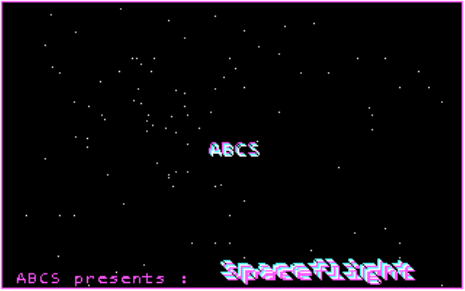
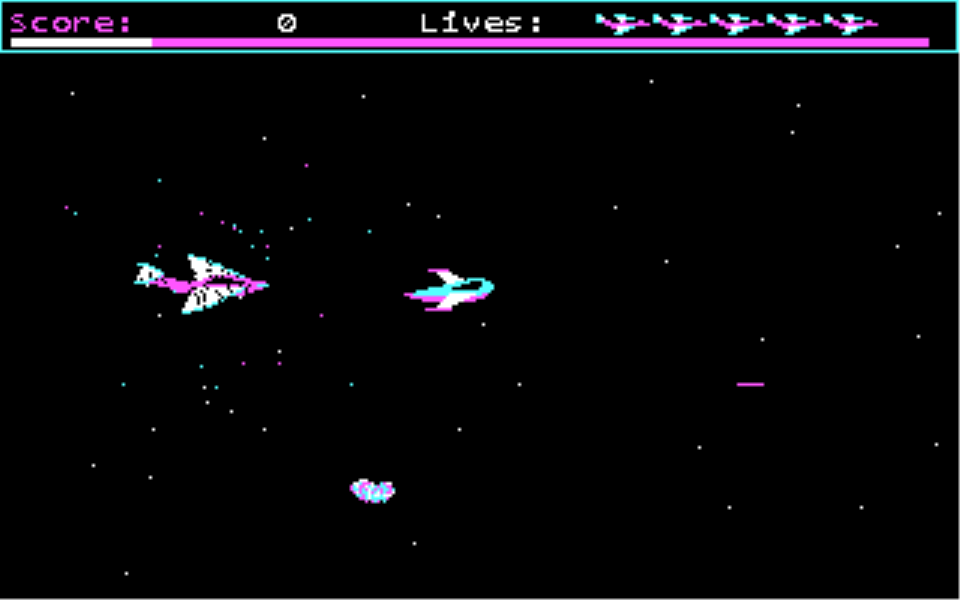
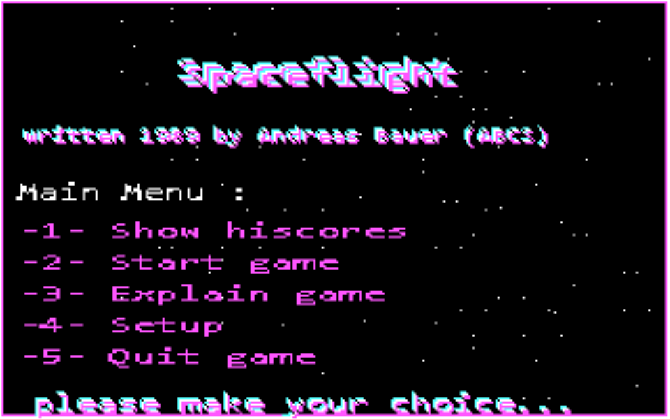

# Spaceflight (1989) — Direct3D-11-Portierung für Windows 10

Moderne Neufassung des CGA-DOS-Spiels *Spaceflight*, das ursprünglich von
Andreas Bauer (ABCS) im Jahr 1989 in Turbo Pascal entwickelt wurde.

Das Spiel läuft jetzt als natives **Direct3D-11**-Programm im **Vollbild** mit
**frei einstellbarer Auflösung bis 2160p**, **TrueColor/RGBA-Palette** und
optionalen **modernen Shader-Effekten** (Scanlines, Glow, Vignette).





*(Die Screenshots zeigen den 320×200-Logikpuffer; die Scanline-/Glow-/Vignette-
Effekte werden erst beim Hochskalieren im Shader hinzugefügt.)*

---

## Ansatz

Der Kern der Modernisierung: Das Spiel rechnet **weiterhin in seinem originalen
320×200-Indexfarbraum** (`gfx.c`, ein Byte pro Pixel = Palettenindex 0–3). Damit
bleibt die komplette Original-Logik erhalten — insbesondere die
*framebuffer-lesende* Kollisions- und Sternenmechanik (`GetPixel`), die das
Original zum Zeichnen der Sterne und für Trefferabfragen nutzt.

Nur der **finale Bildaufbau** ist auflösungsunabhängig: Der 320×200-Puffer wird
pro Frame über eine 4-farbige **RGBA-Palette** in eine Textur gewandelt und mit
einem Fullscreen-Quad + HLSL-Effektshader auf die Zielauflösung hochskaliert
(seitenverhältnisrichtig, wahlweise 4:3 CRT oder 8:5 mit ganzzahliger Skalierung).

### Was gegenüber CGA angepasst wurde
- **Sprites**: Die Original-Arrays (BGI-`GetImage`-Format, 2 Bit/Pixel) werden
  unverändert übernommen (`sprites.h`, generiert aus den `.PAS`-Dateien) und zur
  Laufzeit dekodiert (Header = Breite-1/Höhe-1, Stride = `ceil(Breite/4)`, MSB
  zuerst). Kein Pixel wurde von Hand nachgezeichnet.
- **Farben**: 4-Farb-CGA-Palette → frei einstellbare RGBA-Palette (`g_palette`).
  Standard = klassische CGA-Palette 1 (Cyan/Magenta/Weiß).
- **Bildschirmmodus/BGI** → 320×200-Indexpuffer + D3D11-Präsentation (`platform_win.c`).
- **Deckendes Blitting → Transparenz**: Im Original wurden Sprites als *deckende*
  Rechtecke gezeichnet (Farbe 0 = Schwarz übermalt alles) — bei Überlappungen sah
  man den schwarzen Kasten des vorderen Objekts. Neu: Das Spielfeld wird pro Frame
  gelöscht und die Objekte werden **transparent** (Farbe 0 durchsichtig) über das
  Sternenfeld gezeichnet — korrekte Überlappung, keine schwarzen Kästen, keine
  Schlieren. HUD/Menüs/Titel nutzen weiter das deckende Blitting.
- **PC-Speaker (`Sound`/`NoSound`)** → Rechteckton-Emulation über WinMM
  `waveOut` (Hintergrund-Thread, kontinuierlich gepufferte Square-Wave). Ton ist
  wie im Original per Default aus; im Setup-Menü einschaltbar. Jeder `Sound()`
  klingt mind. ~50 ms aus, damit die vielen kurzen Blips des Originals (Schießen,
  Treffer) trotz Puffer-Latenz hörbar sind.
- **`Delay`/Timing** → fester Timestep (Standard 60 FPS + einstellbares `SpeedDelay`).
- **BIOS-Tastatur (`INT 16h`)** → Win32-Tastatur, Scancodes 1:1 gemappt.
- **Turbo-Pascal-Vektorschrift (`TriplexFont`)** → zur Laufzeit aus einer GDI-
  Schrift erzeugte 16×16-Bitmapschrift (`plat_make_font`). Bewusste Substitution;
  Layout/Positionen bleiben wie im Original.
- **Highscore-Datei** `SPACE.HSC` → eigenes, einfaches Textformat.

---

## Bauen

Voraussetzung: **MinGW-w64** (gcc) im `PATH`. Falls nicht vorhanden:

```
winget install BrechtSanders.WinLibs.POSIX.UCRT
```

Danach in einer **neuen** Shell:

```
build.bat            (Eingabeaufforderung / PowerShell)
./build.sh           (Git-Bash / MSYS)
```

Ergebnis: `Spaceflight.exe`. Der Shader wird zur Laufzeit über
`d3dcompiler_47.dll` (auf Windows 10 vorhanden) kompiliert — es wird **kein
Windows-SDK** benötigt.

Sprites bei Bedarf neu aus den Originaldateien erzeugen:
```
py tools\extract_sprites.py ..\SPACDATA.PAS sprites.h
```

---

## Starten / Optionen

Ohne Argumente: **Vollbild in nativer Desktop-Auflösung**, 4:3, mit Effekten.

| Option              | Wirkung                                                       |
|---------------------|--------------------------------------------------------------|
| `--windowed`        | Fenstermodus statt Vollbild                                  |
| `--width N`         | Backbuffer-/Renderbreite (z. B. `3840`)                     |
| `--height N`        | Backbuffer-/Renderhöhe (z. B. `2160`)                       |
| `--aspect43`        | 4:3-Darstellung (Standard, wie am CRT-Monitor)              |
| `--aspect85`        | 8:5 mit quadratischen Pixeln                                 |
| `--integer`         | ganzzahlige, knackige Skalierung (nur 8:5)                  |
| `--scanline f`      | Scanline-Stärke 0..1 (Standard 0.20)                        |
| `--glow f`          | Glow-Stärke 0..1 (Standard 0.25)                            |
| `--vignette f`      | Vignette-Stärke 0..1 (Standard 0.35)                        |
| `--noeffects`       | alle Effekte aus                                             |
| `--novsync`         | VSync aus                                                    |
| `--fps N`           | Basis-Framerate/Spieltempo (20..240, Standard 60)          |
| `--demo`            | Selbstlauf-Demo (Fenster), erzeugt `shot_*.bmp`            |

Beispiele:
```
Spaceflight.exe --width 3840 --height 2160
Spaceflight.exe --windowed --width 1600 --height 1000 --aspect85 --integer
Spaceflight.exe --noeffects --aspect43
```

### Steuerung (wie 1989)
- Cursortasten + Home/PgUp/End/PgDn: Schiff bewegen (8 Richtungen)
- Leertaste: schießen
- ESC: Pause → beliebige Taste weiter, ESC erneut = Runde beenden
- Im Menü: Zifferntasten 1–5

### Setup (`-4- Setup`) — alles ohne Kommandozeile einstellbar
- **`-1-` Sound**: Rechteckton an/aus.
- **`-2-` Speed**: zusätzliche Verzögerung pro Frame (größer = langsamer).
- **`-3-` Collision**: Kollisionsmodell (gilt für **Zusammenstöße *und* Schüsse**,
  Spieler wie Gegner).
  - **BOX** (Original 1989): Kollision, sobald sich das Schiff/der Schuss im
    *Rechteck* (Bounding-Box) des Objekt-Sprites befindet – auch wenn das
    eigentliche Objekt noch gar nicht berührt wurde.
  - **PIXEL**: pixelgenau – Kollision nur, wenn sich tatsächlich
    nicht-schwarze Sprite-Pixel überlappen.
- **`-4-` Mode**: **WINDOW** ↔ **FULLSCREEN** umschalten (wird sofort angewendet).
- **`-5-` Win-Size**: Fenstergröße durchschalten (1280×720 … 3840×2160), im
  Fenstermodus sofort angewendet. Im Vollbild wird die native Desktop-Auflösung
  genutzt; dieser Wert gilt dann als Fenstergröße für den Wechsel zu WINDOW.
- **`-6-` Main Menu**: zurück. Alle Einstellungen (inkl. Fenster/Vollbild und
  Größe) werden in `SPACE.HSC` gespeichert und beim nächsten Start übernommen.

Die Kommandozeilen-Optionen überschreiben beim Start die gespeicherten Werte.

---

## Dateien

| Datei              | Inhalt                                                         |
|--------------------|----------------------------------------------------------------|
| `game.c`           | Portierte Spiellogik (aus `SPACE.PAS` + `SPACDATA.PAS`)        |
| `gfx.c` / `gfx.h`  | 320×200-Indexpuffer, BGI-Primitiven, Text — Ersatz für `Graph` |
| `platform_win.c` / `platform.h` | D3D11-Vollbild, Effektshader, Input, Timing, GDI-Font |
| `sprites.h`        | Original-Sprite-Bytes (generiert)                             |
| `tools/extract_sprites.py` | Generator für `sprites.h`                             |

---

## Bekannte Einschränkungen
- **Ton**: Rechteckton-Emulation des PC-Speakers über WinMM `waveOut`
  (8-bit/22 kHz, Phase-Accumulator). Standardmäßig aus, im Setup einschaltbar.
  Bei nicht verfügbarem Audiogerät schaltet sich der Ton stillschweigend ab.
- Die Menüschrift ist eine Bitmap-Substitution der originalen Vektorschrift –
  das Schriftbild unterscheidet sich bewusst.
